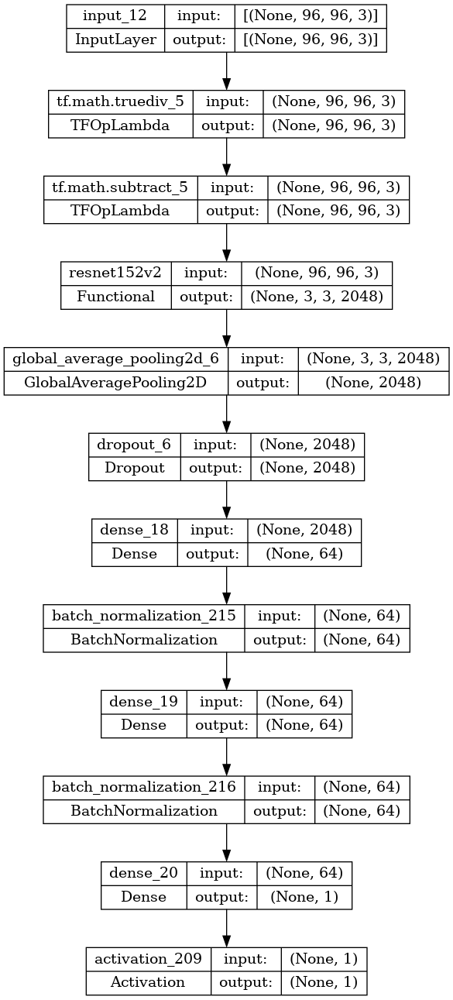
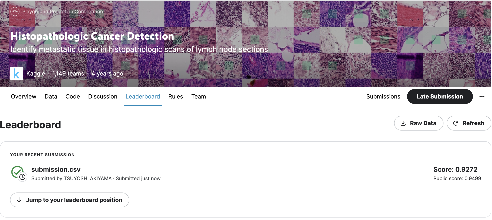

# CNN Cancer Detection

This is the 3rd week assignment in CU Boulder intro deep learning class.

We utilize transfer learning, `Resnet152`  as feature extraction, to get the probability of whether each image contains cancer ot not.

We assume this notebook runs on kaggle notebook. The original kaggle competision is [here](https://www.kaggle.com/competitions/histopathologic-cancer-detection/overview). You can get the same dataset as we use from competision page.

### Files and Folders
* [notebook.ipynb](./notebook.ipynb): Jupyter Notebook containing the data analysis and model building code
* [notebook.pdf](./notebook.pdf): Final pdf report based on jupyter notebook's output

### Prerequisite

* Kaggle account
* Dataset. downloadable from [this link](https://www.kaggle.com/competitions/histopathologic-cancer-detection/data)

### Model Structure

We add 2 fully connected dense layers on top of resnet. The data flows are like this.

1. Feed augumented image data
2. Preprocess in the same way of the dataset resnet trained on, by `tf.keras.applications.resnet_v2.preprocess_input`
3. Extract feature by `Resnet152v`
4. Classify by Dense Layers with dropout and batchnormalization layers
5. Output with sigmoid activation

### Result

The final score would be about `0.92` in ROC

